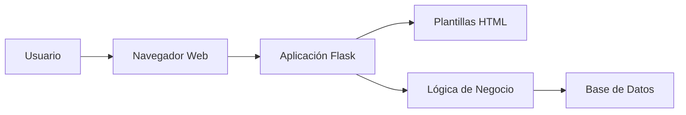

# Simple Web Application

A minimal [Python Flask](https://flask.palletsprojects.com/) web application used as the demo app in the [KodeKloud Docker for Beginners](https://kodekloud.com/courses/docker-for-the-absolute-beginner-hands-on/) course.

The app exposes two routes:

| Route | Response |
|---|---|
| `/` | `Welcome!` |
| `/how-are-you` | `I am good, how about you?` |

## Run manually (without Docker)

These steps assume a fresh machine.

1. Select an OS - Ubuntu

2. Update the package index:

   ```bash
   sudo apt-get update
   ```

3. Install Flask (this also pulls in Python 3):

   ```bash
   sudo apt-get install -y python3-flask
   ```

4. Set the Flask app environment variable:

   ```bash
   export FLASK_APP=app.py
   ```

5. Start the application:

   ```bash
   flask run --host=0.0.0.0
   ```

Then open `http://localhost:5000` and `http://localhost:5000/how-are-you` in a browser.

## Run with Docker

```bash
git clone https://github.com/mmumshad/simple-webapp-flask.git
cd simple-webapp-flask
docker build -t simple-webapp-flask .
docker run -p 5000:5000 simple-webapp-flask
```

Then open `http://localhost:5000` and `http://localhost:5000/how-are-you` in a browser.

## The Dockerfile

```dockerfile
FROM ubuntu

RUN apt-get update
RUN apt-get install -y python3-flask

COPY app.py /opt/app.py

ENV FLASK_APP=/opt/app.py

ENTRYPOINT ["flask", "run", "--host=0.0.0.0"]
```

Each instruction mirrors one of the manual steps above — making it easy to see how a Dockerfile is just an automated install script.

# Student Contribution

## Developer Information

* Name: Paola Jaqueline López Mata
* University: Universidad Tecnológica del Norte de Guanajuato (UTNG)
* Date: June 1, 2026

## Proposed Improvements

1. Agregar una guía de instalación detallada para principiantes.
2. Incluir un diagrama de arquitectura del proyecto dentro de la documentación.
3. Añadir ejemplos de despliegue utilizando Docker y servicios en la nube.

## Observations

Simple WebApp Flask es una aplicación web ligera desarrollada con Flask que sirve como un excelente recurso de aprendizaje para comprender conceptos de desarrollo web y procesos de despliegue. El proyecto es fácil de entender y configurar, lo que lo hace adecuado para estudiantes y desarrolladores que están comenzando a trabajar con aplicaciones web en Python. La incorporación de documentación más detallada y recursos visuales podría mejorar significativamente la experiencia de incorporación de nuevos colaboradores al proyecto.

## Project Strengths

1. El proyecto tiene una estructura sencilla y fácil de comprender, ideal para estudiantes y desarrolladores principiantes que desean aprender Flask.

2. Utiliza Python y Flask, tecnologías ampliamente utilizadas en el desarrollo web por su simplicidad, flexibilidad y gran comunidad de soporte.

3. La aplicación es ligera y requiere pocos recursos para su ejecución, lo que facilita las pruebas y el despliegue en diferentes entornos.

4. El código fuente está organizado de manera clara, permitiendo identificar rápidamente la lógica de la aplicación y realizar modificaciones con facilidad.

5. El proyecto sirve como una excelente base para implementar nuevas funcionalidades, tales como autenticación de usuarios, conexión a bases de datos y despliegue en servicios en la nube.

6. Su configuración e instalación son rápidas, permitiendo que nuevos desarrolladores comiencen a trabajar en el proyecto en poco tiempo.

7. Facilita el aprendizaje de conceptos fundamentales del desarrollo web, incluyendo rutas, plantillas, manejo de solicitudes HTTP y renderizado de páginas.

## Improvement Opportunities

1. Implementar un sistema de autenticación de usuarios para mejorar la seguridad de la aplicación.
2. Integrar una base de datos para almacenar información de manera persistente.
3. Agregar pruebas automatizadas para garantizar la calidad y estabilidad del código.
4. Incorporar un sistema de manejo de errores más robusto y mensajes amigables para el usuario.
5. Mejorar la interfaz gráfica utilizando frameworks modernos como Bootstrap o Tailwind CSS.
6. Añadir documentación más detallada para desarrolladores y colaboradores.
7. Implementar un sistema de despliegue automatizado mediante integración y entrega continua (CI/CD).

---

## Technologies Used

| Tecnología | Descripción                                   |
| ---------- | --------------------------------------------- |
| Python     | Lenguaje principal del proyecto               |
| Flask      | Framework web utilizado para la aplicación    |
| HTML       | Estructura de las páginas web                 |
| CSS        | Diseño y estilos de la interfaz               |
| Docker     | Contenerización y despliegue de la aplicación |
| Git        | Control de versiones                          |
| GitHub     | Gestión y colaboración del proyecto           |

---

## Architecture Diagram



---

## Functional Requirements

RF-01 El sistema deberá permitir el acceso a la aplicación mediante un navegador web.

RF-02 El sistema deberá mostrar una página principal con información del proyecto.

RF-03 El sistema deberá procesar solicitudes HTTP enviadas por los usuarios.

RF-04 El sistema deberá generar respuestas dinámicas utilizando Flask.

RF-05 El sistema deberá renderizar páginas HTML para mostrar información al usuario.

RF-06 El sistema deberá permitir la integración con una base de datos para almacenar información.

RF-07 El sistema deberá gestionar errores y mostrar mensajes apropiados cuando ocurra una excepción.

RF-08 El sistema deberá permitir el despliegue mediante contenedores Docker.

RF-09 El sistema deberá permitir el mantenimiento y actualización del código mediante Git y GitHub.

RF-10 El sistema deberá proporcionar una estructura modular que facilite la incorporación de nuevas funcionalidades.

## Team Members

| Nombre                     | Rol            | Institución                                     |
| -------------------------- | -------------- | ----------------------------------------------- |
| Paola Jaqueline López Mata | Desarrolladora | Universidad Tecnológica del Norte de Guanajuato |
| Integrante 2               | Colaborador    | Pendiente                                       |
| Integrante 3               | Colaborador    | Pendiente                                       |

### Responsabilidades del Equipo

* Desarrollo y mantenimiento de la aplicación web.
* Actualización de la documentación técnica.
* Implementación de nuevas funcionalidades.
* Corrección de errores y optimización del código.
* Realización de pruebas y validación del sistema.

# Evidencia 1
Captura del Fork creado.


# Evidencia 2
Resultado de:
git remote -v


# Evidencia 3
Resultado de:
git branch


# Evidencia 4
Resultado de:
git log --oneline


# Evidencia 5
Captura del Pull Request.


# Evidencia 6
URL del Pull Request
https://github.com/PaolaLpez/simple-webapp-flask/pull/2 

# Reto adicional 🏅


